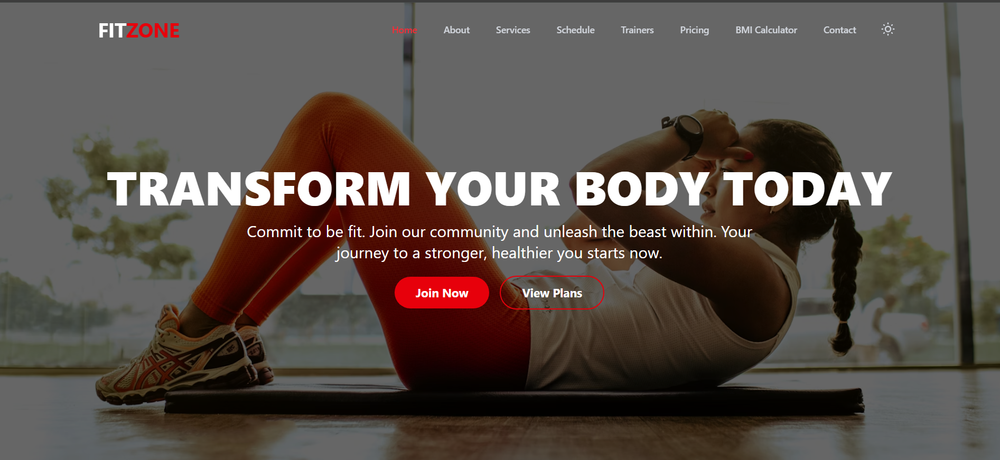
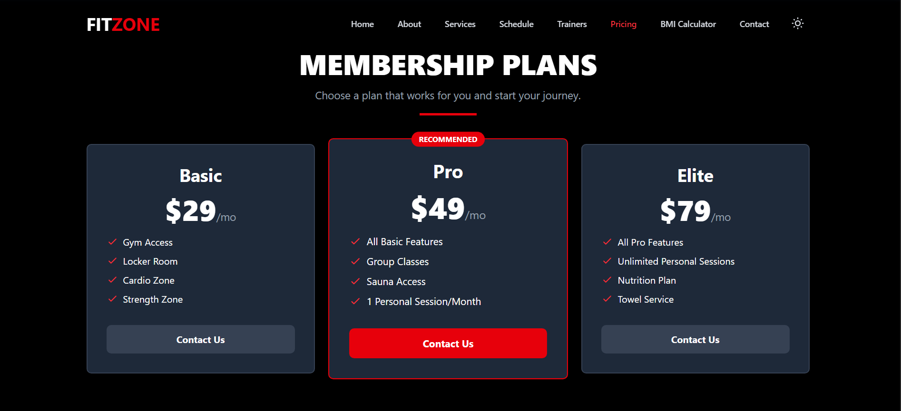
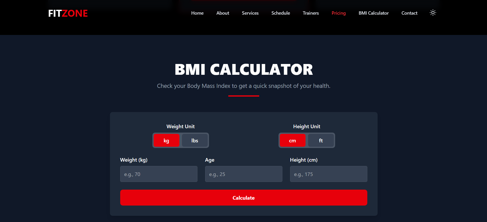
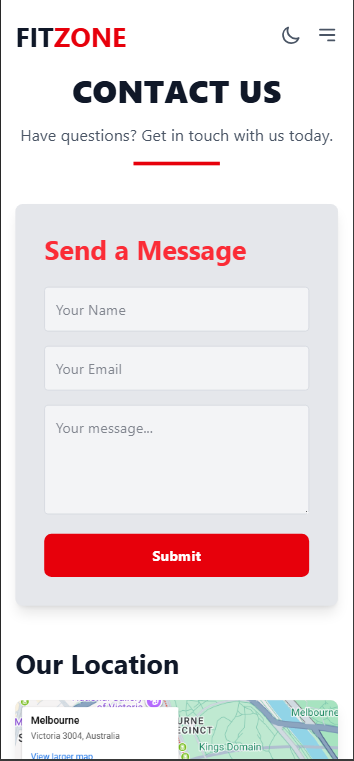
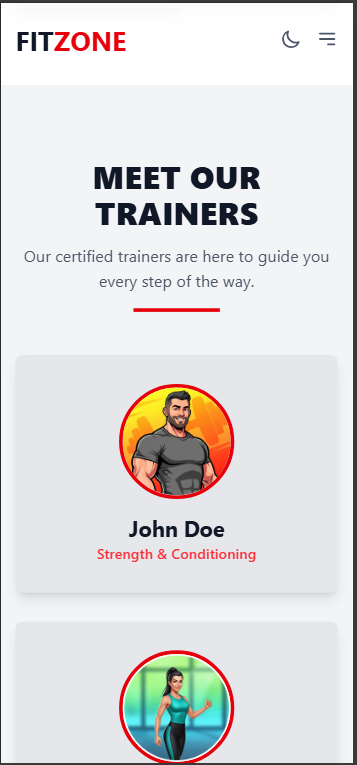

# 🏋️‍♂️ FitZone

A modern, responsive fitness website built with **React + Vite**, designed to inspire healthy living and provide an engaging digital fitness experience.

🔗 **Live Demo**: [FitZone on GitHub Pages](https://anujaga2005.github.io/fitzone/)

---

## ✨ Features

* 💪 **Fitness-Oriented UI** – Sleek, modern, and intuitive design tailored for health and wellness.
* 📱 **Responsive Layout** – Works seamlessly across desktop, tablet, and mobile devices.
* ⚡ **Fast Performance** – Powered by Vite for blazing-fast development and optimized builds.
* 🎨 **Reusable Components** – Clean and modular React components for scalability.
* 🌐 **Deployed on GitHub Pages** – Easy access and smooth hosting.

---

## 🛠️ Tech Stack

* **Frontend**: React (Vite)
* **Styling**: TailwindCSS
* **Hosting**: GitHub Pages
* **Deployment**: gh-pages

---

## 🚀 Getting Started

Follow these steps to run the project locally:

### 1. Clone the repository

```bash
git clone https://github.com/your-username/fitzone.git
cd fitzone
```

### 2. Install dependencies

```bash
npm install
```

### 3. Run development server

```bash
npm run dev
```

Open [http://localhost:5173](http://localhost:5173) to view it in your browser.

### 4. Build for production

```bash
npm run build
```

### 5. Deploy to GitHub Pages

```bash
npm run deploy
```

---

## 📸 Screenshots

### 🖥️ Desktop View  
  
  
  

### 📱 Mobile View  
  
  

---

## 🤝 Contributing

Contributions are welcome! If you’d like to improve this project, feel free to fork and submit a pull request.

---

## 📜 License

This project is licensed under the **MIT License**.

---

### 👨‍💻 Author

Developed with ❤️ by [Anuj Agarwal](https://github.com/AnujAga2005)
